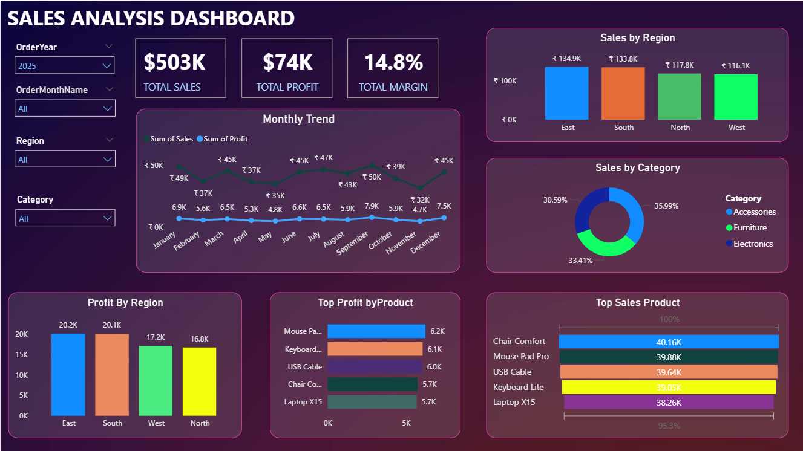

# Sales-Data-Analysis-and-Dashboard
## 📌 Project Overview
This project analyzes the 2025 sales data of **Technova Retail Pvt Ltd** to identify key performance drivers, regional sales trends, and profit insights using **Excel PivotTables** and a **Power BI Dashboard**.  
The main objective is to support **data-driven decision making** by visualizing total sales, profits, and product-level KPIs.

----

## 🧹 Data Preprocessing Steps
- **Handled Missing Data:** Filled numeric values with category-wise means and categorical values with the mode.  
- **Removed Duplicates:** Based on `Date + Product + Region` as unique keys.  
- **Formatted Dates:** Standardized to `DD-MM-YYYY`, derived `Month` and `Quarter`.  
- **Standardized Text:** Corrected inconsistent spacing and case in category/product names.  
- **Handled Outliers:** Removed unrealistic values in `Sales` and `Profit`.  
- **Feature Creation:** Added new column `Profit Margin (%) = (Profit ÷ Sales) × 100`.  
- **Validation:** Verified total sales and profit after cleaning to confirm accuracy.

  -----
  
## 🧮 KPIs Visualized in Power BI
- **Total Sales ($):** Sum of all revenue for 2025  
- **Total Profit ($):** Aggregate profit across all regions  
- **Profit Margin (%):** `(Total Profit ÷ Total Sales) × 100`  
- **Top 5 Products by Sales**  
- **Regional Sales Performance**  
- **Monthly Growth Trend**

----

## 📊 Power BI Dashboard

**File:** [`salesdashbord.pbix`](salesdashboard.pbix)  

**Preview:**

------

## 🧠 Key Insights
- Total Sales reached **₹503K** with a **14.8% overall profit margin**.  
- **East and North regions** generated the highest profit (~₹20.2K).  
- **Accessories** dominated sales, contributing **36%** of total revenue.  
- Sales peaked in **August**, driven by festive demand.  
- **Top Products:** “Mouse Pad Pro” and “Chair Comfort.”

----

## 💡 Recommendations
- Promote **high-margin but low-sales** products to maximize profit.  
- Increase **inventory** in East and South regions.  
- Optimize **pricing** for Furniture category with low profit margins.  
- Launch **marketing campaigns** during August–October (sales peak months).

---

## 🛠️ Tools & Technologies Used
- **Microsoft Excel** — Data cleaning, pivot tables, and summary insights  
- **Power BI** — Interactive dashboards, KPIs, and data visualization  
- **CSV & XLSX** — Dataset storage and transformation formats  

---

